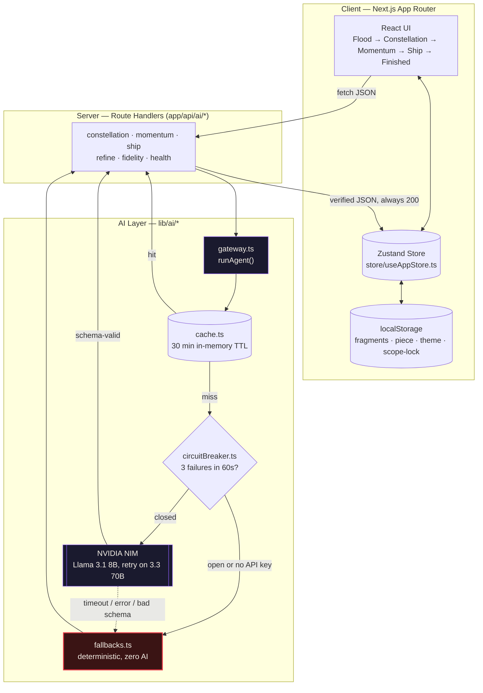
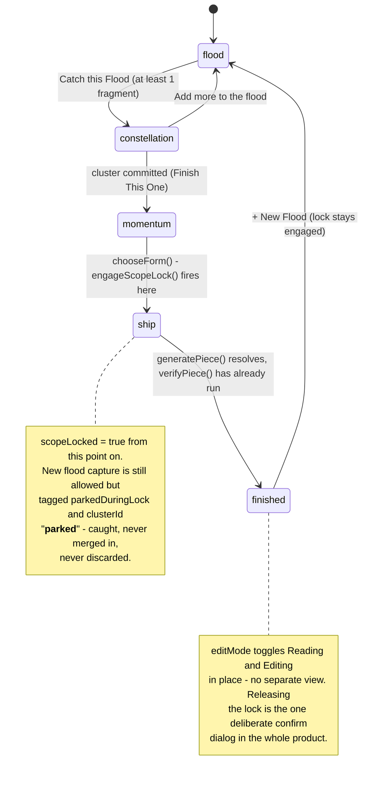
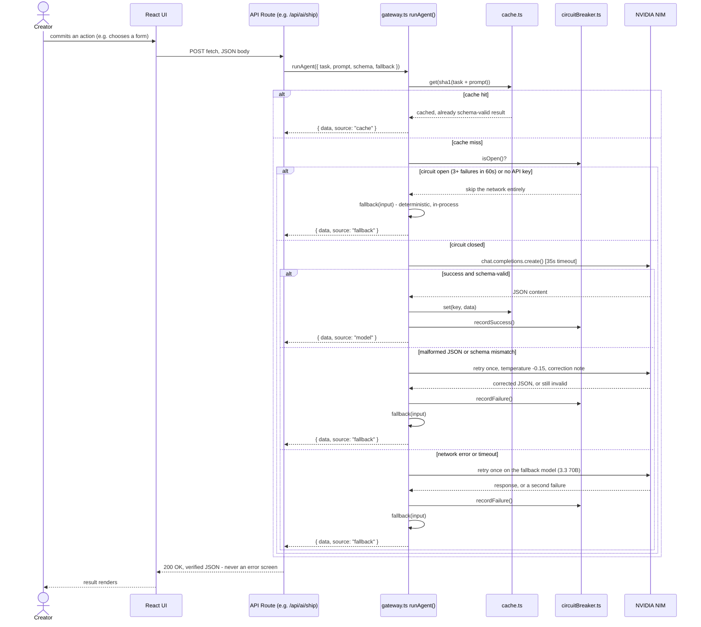
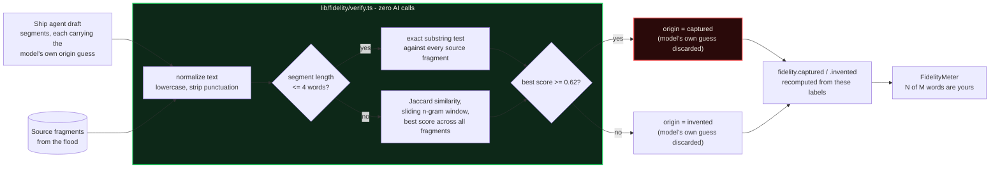
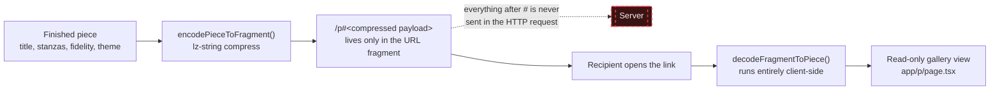

<div align="center">

# 🌊 Catch the Flood

**Your ideas. Your voice. Finished.**

An AI creative amplifier that turns a hyperfocus idea-flood — dozens of scattered fragments — into one finished, shareable piece, without flattening the voice that wrote them.


[🌊 Live Demo](VERCEL_URL) · [📄 Devpost](DEVPOST_URL) · [IncludAI — The Neurodiversity Hackathon](https://includai.dev) × Stanford NNEA, Track 3

<!-- SCREENSHOT PLACEHOLDER — the Finished Piece screen (the "blood moon archive" gallery view) is the strongest single image for this spot. Example:

-->

</div>

---

Neurodivergent creators describe the same pattern during hyperfocus: dozens of voice memos and half-finished lines pile up, and none of them become anything. Every existing creative-AI tool either generates from a blank page or critiques something already finished — nobody helps with the part in the middle. Catch the Flood treats an idea-flood as what it actually is: not one unfinished piece, but several finished ones tangled together, waiting to be told apart. It clusters fragments, scores each cluster by how close it is to *finishable* (not how good it is), assembles a draft, and then independently — with plain code, not another model call — checks every word of that draft against what the creator actually wrote, so the fidelity number on screen is a fact, not a claim.

## Table of Contents

- [The Problem & The Insight](#the-problem--the-insight)
- [What Makes It Different](#what-makes-it-different)
- [System Architecture](#system-architecture)
- [Tech Stack](#tech-stack)
- [Key Technical Decisions](#key-technical-decisions)
- [Accessibility & Neurodivergent-First Design](#accessibility--neurodivergent-first-design)
- [Getting Started](#getting-started)
- [Project Structure](#project-structure)
- [How the Flagship Features Work](#how-the-flagship-features-work)
- [Roadmap / Planned](#roadmap--planned)

---

## The Problem & The Insight

An idea-flood during hyperfocus doesn't produce one draft — it produces fragments from three or four *different* pieces, captured in whatever order they arrived. The creator can't see that from inside it; everything feels equally urgent and equally unfinished, so nothing gets finished. Tools that generate from a blank page don't help, because generation was never the hard part. Tools that polish an already-finished draft don't help either, because there's no draft yet — there's a pile.

The actual unsolved problem is **triage**: which fragments belong together, and which of those groups is closest to being done *right now*. That's what this product is built around, end to end.

## What Makes It Different

| Feature | What it does | Why it's novel |
|---|---|---|
| **Constellation clustering + readiness** | Groups tangled fragments into distinct clusters and scores each one by *closeness to finishable* — not quality, not importance. | Readiness-to-finish is a triage axis nobody else scores on. It answers "which one should I finish first," not "which one is best." |
| **Fidelity Verifier** | An independent, deterministic, non-AI algorithm re-checks every segment of a generated piece against the source fragments and **overrides** the model's own origin label. | The model's self-reported "this is your word" claim is never trusted. The count on screen is computed by code that re-derives it from scratch. |
| **Scope-Lock** | Once a creator commits to finishing one piece, new captures are still caught but visibly *parked*, not merged in. | An executive-function feature, not a content feature: the app helps by refusing, the same way a good editor tells you "not now" without throwing the idea away. |
| **Never-fail AI gateway** | Every agent call goes through one gateway with an in-memory cache, a circuit breaker, and a fully deterministic fallback generator. | A hackathon demo on free-tier, rate-limited infrastructure cannot afford a spinner that never resolves. This app is designed to always finish. |
| **Zero-storage share** | A finished piece is compressed and encoded entirely into the URL fragment (`#...`) — the part of a URL a browser never sends to any server. | No database, no accounts, and a share link that is *structurally* incapable of leaking to a server, not just "we promise not to look." |
| **Adaptive presentation + Safe Mode** | The finished piece's visual theme is suggested from the piece's own content (dark → Blood Moon, warm → Dawn, reflective → Tide, plain → Paper), and app-wide Safe Mode always overrides it. | Mood-matched presentation as an expression feature, with an accessibility guarantee that can never be aesthetic-optioned away. |

---

## System Architecture

### High-level architecture


*Every path — cache hit, model success, or total provider failure — returns a schema-valid result to the UI. The client never has to handle an AI error state, because one never reaches it.*

### The user journey state machine


*Matches the real `AppView` union in `store/useAppStore.ts` exactly: `"flood" | "constellation" | "momentum" | "ship" | "finished"`. There is no routing — this is one page, driven entirely by this state machine.*

### The AI gateway sequence (one agent call, in full)


*Three independent failure classes — cold cache, an open circuit, and a live provider failure — all converge on the same deterministic fallback path. `source` (`"model" | "cache" | "fallback"`) is returned with every result so the actual path taken is always inspectable, including live at `/api/ai/health`.*

### The fidelity verification flow


*The model's `origin` field is read exactly once, as a hint for which fragment to check first — never as the final answer. This same function runs after the initial draft, after every inline edit, and after every single-stanza "reshape," so the count can never silently drift out of sync with the visible text.*

### Zero-storage share


*This isn't a policy promise — it's how URL fragments work at the protocol level. The server that serves `/p` never sees the fragment at all.*

---

## Tech Stack

Every entry below is a real dependency in `package.json` or a real browser API called from the code — nothing aspirational.

| Layer | Technology | Notes |
|---|---|---|
| **Framework** | Next.js 15 (App Router), React 19, TypeScript (strict) | One page (`app/app/page.tsx`), driven by client-side state — no server routing between views |
| **State** | Zustand 5, with `persist` middleware to `localStorage` | A single store (`store/useAppStore.ts`) holds fragments, clusters, the piece, scope-lock, and theme |
| **Styling / Motion** | Tailwind CSS 3, hand-authored CSS custom properties for theming, Framer Motion | No UI kit — every icon in `components/icons/` is a hand-authored inline SVG |
| **AI** | `openai` SDK pointed at NVIDIA NIM (`https://integrate.api.nvidia.com/v1`), Zod for response schema validation | Free tier. Primary model `meta/llama-3.1-8b-instruct`, retries on `meta/llama-3.3-70b-instruct` |
| **Voice capture** | Web Speech API (`SpeechRecognition` / `webkitSpeechRecognition`) | Feature-detected; text capture is the fully-supported default everywhere |
| **Export / Share** | `html-to-image`, `jspdf`, `qrcode`, `lz-string` | PNG poster export, print-ready PDF, a scannable QR code, and the URL-fragment share codec |
| **Native platform APIs** | Web Share API, Clipboard API, `prefers-reduced-motion`, `matchMedia` | Used directly, no polyfill libraries |
| **Persistence** | `localStorage` only | No database, no backend service, no accounts |

**Cost to run:** $0. NVIDIA NIM's free tier, Vercel's free tier, and every other dependency above ships with no paid service in the loop.

---

## Key Technical Decisions

**Code-verified fidelity over model self-report.** The Ship agent's prompt asks the model to tag its own output as `"captured"` or `"invented"` — and the app never trusts that tag. `lib/fidelity/verify.ts` independently re-scores every segment against the actual source fragments and overrides the label unconditionally. An LLM regularly mislabels its own output under instruction; a self-report is not a fact, and this product's entire pitch is being more honest than that.

**Deterministic fallbacks for every single agent, not a shared error state.** `lib/ai/fallbacks.ts` implements a real, usable generator for constellation clustering, momentum options, ship assembly, and refine — each pure, synchronous, and fast. This isn't a degraded mode bolted on for safety; `fallbackShip` in particular is philosophically correct on its own terms: it assembles the piece from the creator's own fragment text with zero invention, so a piece finished entirely offline is provably 100% the creator's words.

**Selecting a cluster and committing to it are two different actions.** Clicking a constellation orb calls `selectCluster()` and only opens a preview panel; nothing navigates. Only the "Finish This One →" button inside that panel commits. Browsing and choosing are different cognitive acts, and collapsing them into one click would turn exploration into an accidental decision.

**Scope-lock is the one deliberate exception to "no confirmation dialogs."** Every other destructive-feeling action in the app (removing a fragment, removing a stanza) uses an undo toast, never a confirm prompt. Releasing scope-lock is the single dialog in the whole product (`components/scopelock/ReleaseLockPrompt.tsx`), and its own source comment states why: *"guard user's own intention rather than second-guessing a destructive action."* Everywhere else, the app trusts the creator by default; here, it asks once, because walking back a commitment is different from undoing a keystroke.

**URL-fragment sharing instead of a database.** `encodePieceToFragment()` compresses the whole piece with `lz-string` into the part of a URL that browsers never transmit to a server. No share-link table, no cleanup job, no piece a stranger could enumerate — the mechanism itself rules that out.

**Safe Mode always outranks aesthetic choice.** `hooks/useEffectiveTheme.ts` is the single place presentation-theme precedence is resolved: `isSafe ? CALM_THEME : (presentationTheme ?? suggestedTheme)`. No other component computes that precedence independently, so a user's chosen "Blood Moon" theme can never quietly survive into a state that's supposed to be calm.

---

## Accessibility & Neurodivergent-First Design

This isn't a section at the bottom — it's the reason the rest of the architecture exists. Every item below is implemented in the current code, not aspirational.

- **No gamification.** No streaks, no countdown timers, no progress bars framed as pressure. The one meter in the product (fidelity) reports a fact, not a score to chase.
- **No alarming states.** Removing a fragment, an offline AI fallback, a failed export — none of it is rendered in red or as an error banner. `lib/ai/fallbacks.ts` exists specifically so the failure path is never user-visible as a failure.
- **Safe Mode**, toggleable from the footer on every screen, swaps to a calm, high-contrast palette, disables the atmospheric backdrop animation and film grain, and raises body text size — verified to always override the presentation theme (see [Key Technical Decisions](#key-technical-decisions)).
- **Dyslexia-friendly typeface option** — a system font stack (Atkinson Hyperlegible → Verdana → system UI), toggleable independently of Safe Mode.
- **`prefers-reduced-motion` honored everywhere**, independently of Safe Mode — a global CSS rule collapses every animation/transition duration to near-zero, and Framer Motion's `reducedMotion="user"` config does the same for JS-driven motion.
- **Full keyboard operability** — every interactive surface, including the constellation map's orbs and the stanza-reorder controls, has a keyboard path (arrow-key equivalents, not drag-only), with a visible focus ring.
- **WCAG-AA contrast across all four presentation themes**, measured, not assumed — every theme's body text on its ground and its verbatim-highlight color on its canvas clears 4.5:1.
- **`aria-live` announcements** for state changes that matter non-visually: theme switches, fidelity count changes, reshape status.
- **Nothing is ever silently lost.** An abandoned voice fragment (cut off mid-sentence) is kept, not discarded, and flagged as `abandoned` rather than treated as an error. A fragment captured while scope-locked is *parked*, not dropped. Both are first-class states in the data model (`types/domain.ts`), not edge cases handled by omission.
- **Zero-friction capture.** Voice and text capture sit side by side with no mode switch; a fragment commits on a pause, on blur, or on an explicit action — never requires a "save" step the creator has to remember.
- **No accounts, ever.** Nothing to sign up for, nothing to lose access to.

<details>
<summary><strong>Neurodivergent co-design / user testing</strong></summary>

_PLACEHOLDER — if real co-design sessions, tester feedback, or specific changes made in response to neurodivergent testers exist, document them here with names/roles (with permission) and the concrete change each piece of feedback produced. Do not fill this section with a generic claim if that testing didn't happen._

</details>

---

## Getting Started

**Prerequisites:** Node.js 20+, npm.

```bash
git clone https://github.com/rakeshselvaraj0108/neuro.git
cd neuro
npm install
```

Copy the example env file and add a free NVIDIA NIM key (optional — see below):

```bash
cp .env.example .env.local
```

```bash
# .env.local
NVIDIA_API_KEY=nvapi-...
```

Get a free key at **[build.nvidia.com](https://build.nvidia.com)** (`nvapi-...`).

> **You do not need a key to run this app.** With `NVIDIA_API_KEY` unset or empty, `AI_ENABLED` is `false` and every agent call routes straight to its deterministic fallback (`lib/ai/fallbacks.ts`) with zero network calls attempted. The full flood → constellation → momentum → finished flow works end to end, offline-capable, in under a minute — this is a genuine, testable property of the code, not a fallback that merely avoids crashing.

```bash
npm run dev
```

Open **http://localhost:3000/app** — that's the product itself (`/` is the marketing landing page).

```bash
npm run build   # production build, zero TypeScript / lint errors required
npm run typecheck
```

**Deploying:** built and verified against [Vercel](https://vercel.com). Connect the repository, set `NVIDIA_API_KEY` as an environment variable in the project settings (or leave it unset — see above), and deploy. No other configuration or infrastructure is required.

---

## Project Structure

<details>
<summary><strong>Expand the annotated directory tree</strong></summary>

```
app/
├─ page.tsx                    # "/" — marketing landing page
├─ app/page.tsx                # "/app" — the actual product (mounts AppOrchestrator)
├─ p/page.tsx                  # "/p" — read-only shared-piece viewer, decodes the URL fragment
├─ layout.tsx                  # Fonts (Cinzel, Cormorant Garamond, Inter), theme bootstrap script
└─ api/ai/
   ├─ constellation/route.ts   # Clusters fragments, scores readiness
   ├─ momentum/route.ts        # Suggests finished forms for a chosen cluster
   ├─ ship/route.ts            # Assembles the draft piece
   ├─ refine/route.ts          # Rewrites a single stanza per instruction
   ├─ fidelity/route.ts        # Fidelity recomputation endpoint
   └─ health/route.ts          # Live gateway diagnostic (source, latency, circuit state)

lib/
├─ ai/
│  ├─ gateway.ts               # runAgent() — the ONE place that calls NVIDIA NIM
│  ├─ cache.ts                 # In-memory 30-minute TTL cache
│  ├─ circuitBreaker.ts        # Opens after 3 failures in 60s
│  ├─ fallbacks.ts             # Deterministic generator per agent task
│  ├─ prompts.ts               # System/user prompt builders per task
│  ├─ schemas.ts                # Zod schemas every model response must satisfy
│  └─ env.ts                   # AI_ENABLED — true only if a key is present
├─ fidelity/
│  ├─ verify.ts                # The independent, non-AI verification algorithm
│  ├─ reverify.ts              # Re-runs verification after an inline edit
│  └─ normalize.ts             # Shared text normalization
├─ constellation/layout.ts     # Pure trig for the constellation map's orb positions
├─ presentation/
│  ├─ themes.ts                # 4 presentation themes + the Safe Mode calm variant
│  └─ suggestTheme.ts          # Deterministic, keyword-based theme suggestion
└─ share/encode.ts             # lz-string codec for the zero-storage share link

store/useAppStore.ts           # The entire app: view state machine, fragments,
                                # constellation, momentum, scope-lock, piece, theme

components/
├─ screens/                    # FloodScreen, ConstellationScreen, MomentumScreen,
│                               # ShipScreen, FinishedPieceScreen — one per AppView state
├─ flood/                      # Capture dock, fragment cards, voice toggle
├─ constellation/               # ConstellationMap, ClusterOrb, DetailPanel
├─ piece/                       # PieceCanvas, Verbatim, FidelityMeter, BackdropRenderer,
│                                # EditableStanza, ThemePicker — the finished-piece surface
├─ scopelock/                   # LockIndicator, ReleaseLockPrompt
├─ export/                      # PNG/PDF export, SharePopover with QR code
└─ icons/                       # Every glyph, hand-authored inline SVG, zero icon library

types/domain.ts                # Fragment, Cluster, PieceSegment, Piece, JourneyStep
hooks/                         # useSafeMode, useEffectiveTheme, useVoiceCapture, etc.
```

</details>

---

## How the Flagship Features Work

### Fidelity verification

Every segment of a generated draft is normalized (lowercased, punctuation stripped) and checked against the source fragments two ways: segments of 4 words or fewer require an exact substring match; longer segments are scored by Jaccard similarity over a sliding n-gram window the same length as the segment, taking the best score across every source fragment. A score at or above **0.62** forces `origin: "captured"` — below it, `"invented"` — regardless of what the model itself claimed:

```ts
// lib/fidelity/verify.ts
const origin: SegmentOrigin = matchScore >= CAPTURED_THRESHOLD ? "captured" : "invented";
```

The same function runs after the initial draft, after every inline edit (a user's own typed edit is *always* treated as captured — editing in your own hand cannot make a piece less yours), and after every single-stanza reshape. See `lib/fidelity/verify.ts`.

### Constellation readiness

When the AI path is available, the model itself judges each cluster's readiness as part of the clustering prompt. The deterministic fallback (used offline, or when the AI is unavailable) scores it from three input-relative signals, weighted 45/35/20 — fragment count (saturating at 5+), average fragment length (saturating at ~90 characters), and recency within the batch's own timestamp span — so it's the same axis, computed without a network call. See `lib/ai/fallbacks.ts`.

### Never-fail fallback

Every agent call passes through one function, `runAgent()` in `lib/ai/gateway.ts`: check the cache, check the circuit breaker, attempt the model call with a 35-second timeout and one retry on a schema mismatch, retry once more on a different model on a network failure — and if every one of those steps fails, call the caller-supplied deterministic fallback. `runAgent()` is written to never throw; it always resolves with a valid, schema-conformant result and a `source` field (`"model" | "cache" | "fallback"`) so the actual path taken is always inspectable — including live, at `/api/ai/health`.

---

## Roadmap / Planned

- **Deploy-on-push from GitHub** — the Vercel project is currently deployed via CLI rather than connected for continuous deployment.
- **Persisted "return to your finished piece" after a reload** — `currentPiece` and the theme choice persist to `localStorage`, but the view itself always resets to Flood on a fresh load, so there's currently no in-app affordance to jump straight back to an already-finished, still-locked piece without re-navigating.
- **Formal neurodivergent co-design testing** — see the placeholder above.
- **Automated test suite** — correctness today is verified through targeted manual and scripted browser testing during development, not a committed CI test suite.

---

## Footer

Built for **IncludAI — The Neurodiversity Hackathon**, in partnership with **Stanford NNEA**. Track 3: AI Creative Amplifier.

**License:** TBD — _placeholder, add a LICENSE file and update this badge/line._

**Credits / Acknowledgments:** _PLACEHOLDER — team names, mentors, and any testers to credit._

<div align="center">

*"AI didn't write this. You did. It just helped you finish."*

</div>
